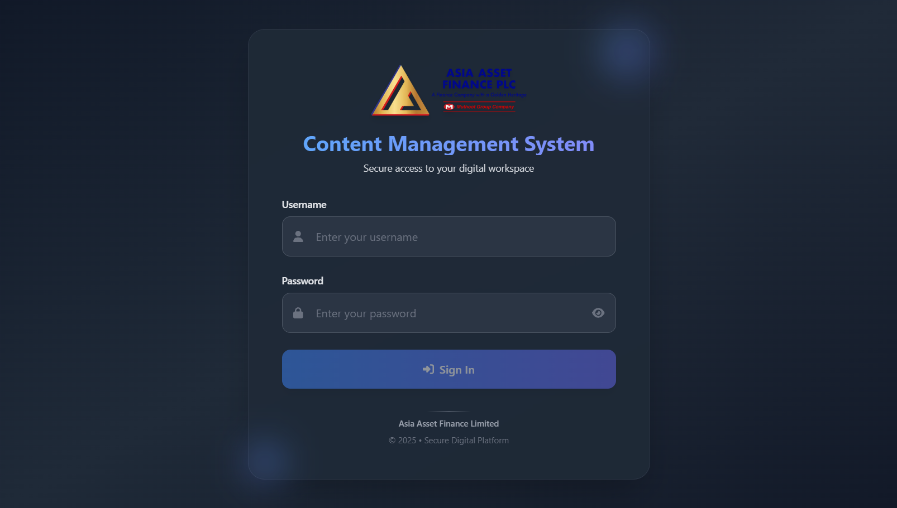
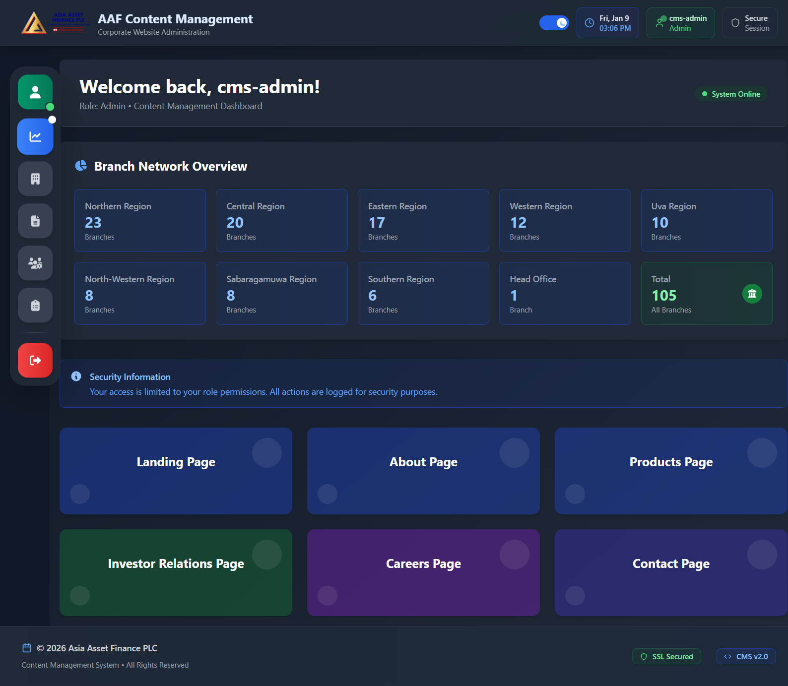
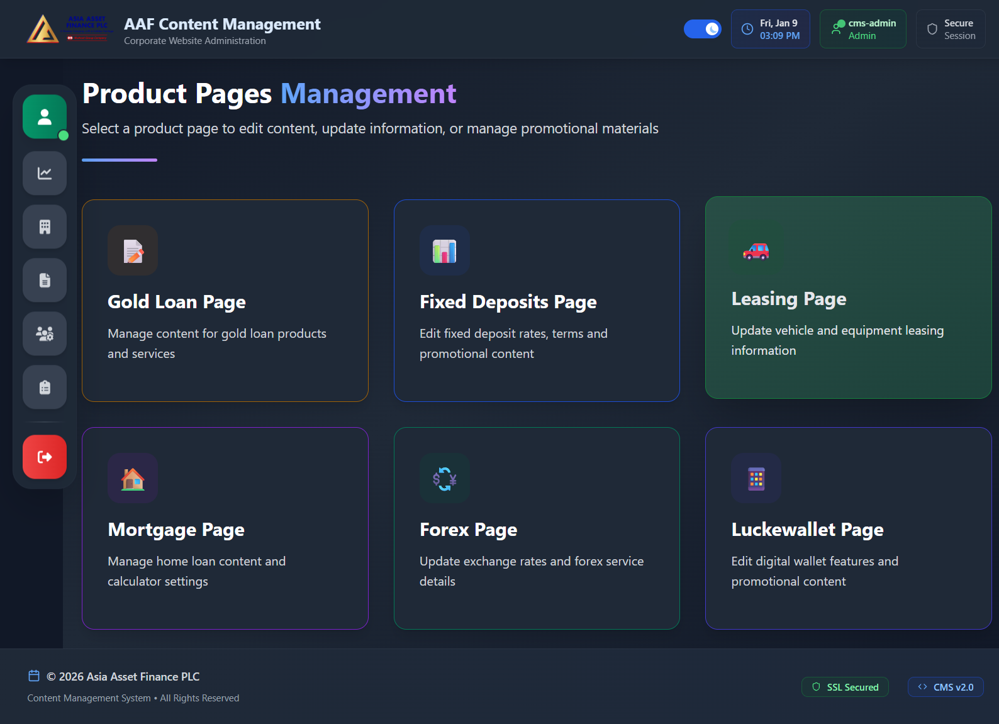
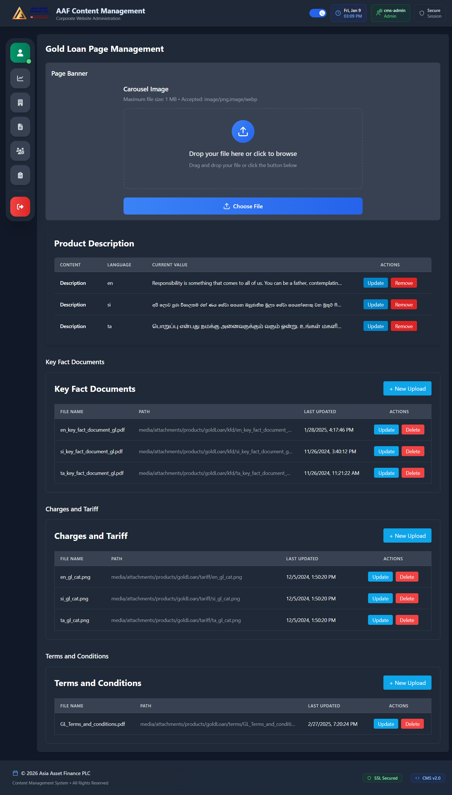
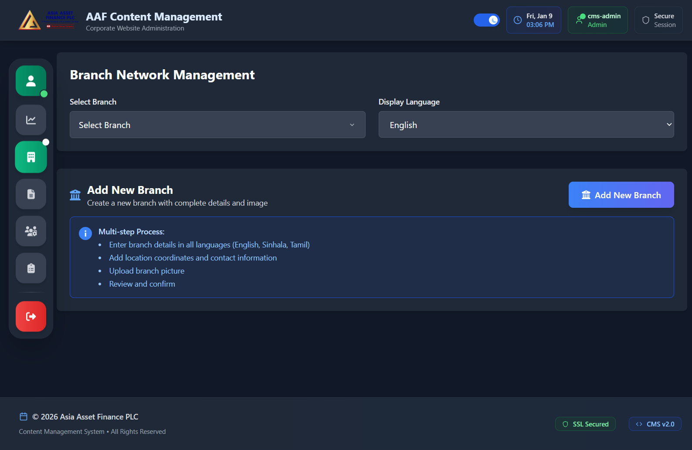
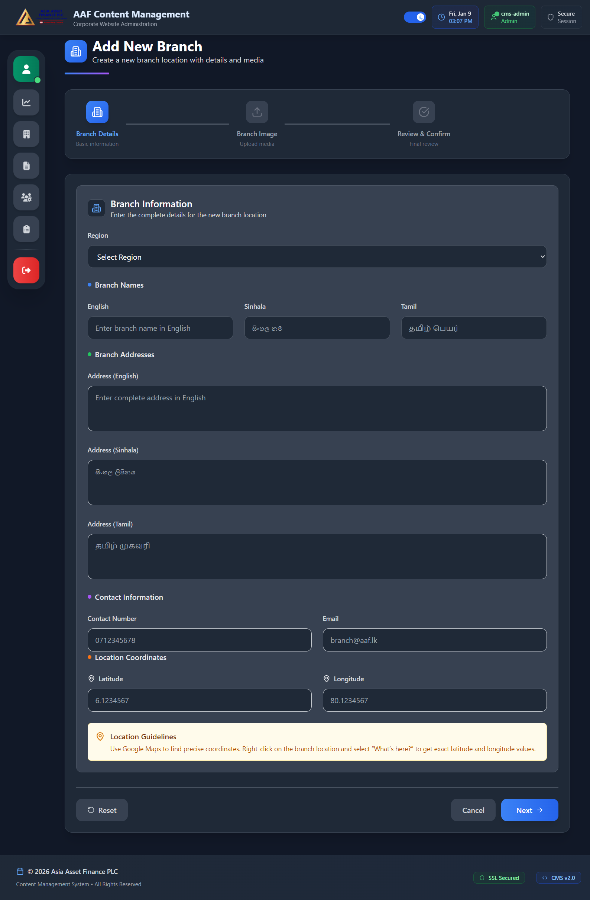
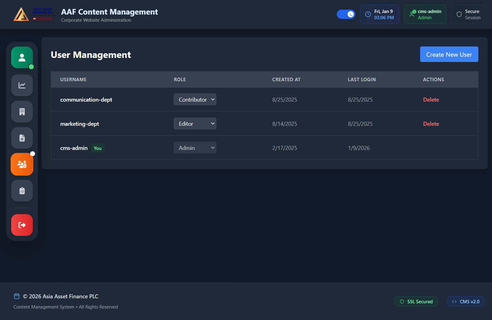

# 🖥️ Asia Asset Finance – Custom CMS

This repository contains the Custom Content Management System (CMS) developed for the Asia Asset Finance PLC corporate website revamp.

The CMS was built to give administrators an easy, secure, and scalable platform to manage multilingual content, media uploads, and branch details.

This project showcases my ability to design and develop a full-stack web application with Node.js, Express, MySQL, and React, including role-based access control (RBAC) and logging for monitoring and debugging.

## 📸 System Previews

### Secure Login Interface


### Admin Dashboard Overview


### Product Page Management


### Detailed Content Editing (Gold Loan Example)


### Branch Network Administration



### User & Role Management


## 🚀 Quick Start

### Database Setup
```bash
# 1. Create database
mysql -u root -p -e "CREATE DATABASE aaf_cms_db CHARACTER SET utf8mb4 COLLATE utf8mb4_unicode_ci;"

# 2. Run migration
mysql -u root -p aaf_cms_db < database/migrations/001_initial_schema.sql

# 3. Configure environment
cp .env.example .env
# Edit .env with your database credentials
```

### Installation
```bash
# Install dependencies
npm install

# Start development
npm run dev        # Frontend (Vite)
npm start          # Backend (Node.js)
```

### Default Login
- **Username**: `admin`
- **Password**: `admin123` ⚠️ *Change immediately after first login!*

## 📊 Database Documentation

- 📋 **[Complete Schema Documentation](./docs/DATABASE_SCHEMA.md)** - Detailed table structures, relationships, and indexes
- 🗺️ **[Entity Relationship Diagram](./docs/DATABASE_ERD.md)** - Visual database schema with Mermaid diagrams
- � **[Data Dictionary](./docs/DATABASE_DATA_DICTIONARY.md)** - Comprehensive field specifications and constraints
- �🔧 **[Migration Scripts](./database/migrations/)** - Ready-to-run SQL setup scripts
- 📖 **[Database Setup Guide](./database/README.md)** - Step-by-step installation instructions
- 🔍 **[Database Analysis Tool](./database/analyze_database.sql)** - Query script for database health checks

## ✨ Features

🔑 **Authentication & Security** – JWT-based login system with session handling.

🛡️ **Role-Based Access Control (RBAC)** – Different user roles with specific permissions:
- **Super Admin** → Full system access including user management
- **Admin** → Full access (manage content, media, branches) except user management  
- **Editor** → Can update content and media but cannot manage users
- **Viewer** → Read-only access

🌍 **Multilingual Content Management** – Manage content in English, Sinhala, and Tamil.

🖼️ **Media Uploads & File Handling** – Upload, replace, and manage media with overwrite functionality (Multer).

👤 **Profile Management** – Update Board of Directors & Corporate Management profiles with images.

🏢 **Branch Directory** – Manage branches with names, addresses, contacts, and geo-coordinates.

📊 **Database Integration** – MySQL for structured and relational data storage with comprehensive logging.

📱 Responsive Admin UI – Built with React + Tailwind CSS.

📜 Centralized Logging System – Using Winston/Morgan for request/response logging, error tracking, and audit trails.

🚀 Two-Frontend Architecture –

CMS Admin Panel (http://localhost:5174)

Website Frontend (http://localhost:5173)

🛠️ Tech Stack

Frontend (CMS Panel):

React (Vite)

Tailwind CSS

Backend:

Node.js (Express.js)

Multer (file uploads)

JWT Authentication

Role-Based Access Control (RBAC) Middleware

Winston + Morgan (Logging & Monitoring)

Database:

MySQL

Deployment (Planned/Options):

Frontend: Vercel

Backend: Railway / Render / PHP alternative

Database: PlanetScale / Railway MySQL

⚙️ Installation & Setup
1️⃣ Clone the repository
git clone https://github.com/BrayanJay/aaf-cms.git

2️⃣ Install dependencies
cd cms-backend
npm install

3️⃣ Configure environment variables

Create a .env file in the backend:

PORT=5000
DB_HOST=localhost
DB_USER=root
DB_PASSWORD=yourpassword
DB_NAME=aaf_cms
JWT_SECRET=yourjwtsecret
LOG_LEVEL=info

4️⃣ Run the backend
npm run dev

5️⃣ Start the CMS frontend
cd cms-frontend
npm install
npm run dev

📂 Project Structure
cms-project/
│── cms-backend/         
│   ├── routes/          # API routes
│   ├── controllers/     # Business logic
│   ├── middleware/      # Auth, RBAC, Logger middleware
│   ├── logs/            # Application logs (rotating daily logs)
│   ├── uploads/         # Uploaded media files
│   ├── utils/logger.js  # Winston logger configuration
│   └── server.js        
│
│── cms-frontend/        
│   ├── components/      
│   ├── pages/           
│   └── App.jsx
│
└── website-frontend/    

🚀 Key APIs

POST /login → Admin/Editor/Viewer login with JWT (logged)

POST /upload → Upload/replace media (Admin + Editor, logged with filename + user ID)

GET /branches → Fetch branches (logged with query params)

PUT /profiles/:id → Update profiles (Admin + Editor, logged with changes)

DELETE /media/:filename → Delete media (Admin only, logged for audit trail)

POST /users/create → Create CMS users (Admin only, logged)

GET /users → List users (Admin only)

📝 Logging System

Winston – Used for structured logging with multiple transports (console + file).

Morgan – Middleware for HTTP request logging.

Daily Rotate Logs – Separate log files per day for easier monitoring.

Error Logging – All errors (including unhandled ones) are logged with stack trace.

Audit Trails – Key CMS actions (login, file upload, content update, delete) are logged with user role & timestamp.

Example log output:

[2025-08-25 10:15:32] INFO: User 'admin' uploaded file 'branch-banner.webp'
[2025-08-25 10:16:02] WARN: Unauthorized access attempt by user 'editor' to /users/create
[2025-08-25 10:17:45] ERROR: Database connection failed (MySQL timeout)

📌 Highlights

This CMS demonstrates my skills in:

Full-stack development (React + Node + MySQL)

Secure authentication & RBAC

Centralized logging & monitoring (Winston + Morgan)

REST API design with audit trails

File system integration (media upload + overwrite)

Multilingual content management

Database-driven applications

Production-ready architecture

📬 Contact

👋 I’m Brayan Jayawardana, a Full Stack Web Developer passionate about building scalable digital solutions.

📧 Email: wmbk.jayawardana1@gmail.com

💼 LinkedIn: www.linkedin.com/in/brayanjay

🖼️ Portfolio: www.brayanjay.web.lk

⚡ This CMS is a proprietary project for Asia Asset Finance PLC. All rights reserved.
