# Database Entity Relationship Diagram (ERD)

## Visual Database Schema

```mermaid
erDiagram
    users {
        int id PK
        varchar username UK
        varchar password
        enum role
        varchar token
        timestamp last_login
        timestamp created_at
        timestamp updated_at
    }
    
    board_of_directors {
        int id PK
        varchar profile_picture
        varchar name_en
        varchar name_si
        varchar name_ta
        varchar designation_en
        varchar designation_si
        varchar designation_ta
        text description_en
        text description_si
        text description_ta
        timestamp updated_at
        int uploaded_by FK
    }
    
    corporate_management {
        int id PK
        varchar profile_picture
        varchar name_en
        varchar name_si
        varchar name_ta
        varchar designation_en
        varchar designation_si
        varchar designation_ta
        text description_en
        text description_si
        text description_ta
        timestamp updated_at
        int uploaded_by FK
    }
    
    profile_content {
        int profile_id PK
        text content
        timestamp updated_at
        int uploaded_by FK
    }
    
    file_uploads {
        int id PK
        varchar original_filename
        varchar saved_filename
        varchar file_path
        int file_size
        varchar mime_type
        int uploaded_by FK
        timestamp upload_timestamp
    }
    
    logger {
        int id PK
        int user_id FK
        varchar username
        varchar action
        varchar target_type
        varchar target_id
        varchar ip_address
        text user_agent
        timestamp timestamp
        json details
    }
    
    branches {
        int id PK
        varchar region_id
        varchar branch_name_en
        varchar branch_name_si
        varchar branch_name_ta
        text branch_address_en
        text branch_address_si
        text branch_address_ta
        varchar region_name_en
        varchar region_name_si
        varchar region_name_ta
        varchar contact_number
        varchar email
        decimal coordinates_longitude
        decimal coordinates_latitude
        varchar branch_image
        timestamp created_at
        timestamp updated_at
        int uploaded_by FK
    }
    
    mortgage {
        int id PK
        text content_en
        text content_si
        text content_ta
        timestamp updated_at
        int uploaded_by FK
    }
    
    fixed_deposits {
        int id PK
        text content_en
        text content_si
        text content_ta
        timestamp updated_at
        int uploaded_by FK
    }
    
    leasing {
        int id PK
        text content_en
        text content_si
        text content_ta
        timestamp updated_at
        int uploaded_by FK
    }
    
    gold_loan {
        int id PK
        text content_en
        text content_si
        text content_ta
        timestamp updated_at
        int uploaded_by FK
    }
    
    forex {
        int id PK
        text content_en
        text content_si
        text content_ta
        timestamp updated_at
        int uploaded_by FK
    }
    
    luckewallet {
        int id PK
        text content_en
        text content_si
        text content_ta
        timestamp updated_at
        int uploaded_by FK
    }

    %% Relationships
    users ||--o{ board_of_directors : "uploaded_by"
    users ||--o{ corporate_management : "uploaded_by"
    users ||--o{ profile_content : "uploaded_by"
    users ||--o{ file_uploads : "uploaded_by"
    users ||--o{ logger : "user_id"
    users ||--o{ branches : "uploaded_by"
    users ||--o{ mortgage : "uploaded_by"
    users ||--o{ fixed_deposits : "uploaded_by"
    users ||--o{ leasing : "uploaded_by"
    users ||--o{ gold_loan : "uploaded_by"
    users ||--o{ forex : "uploaded_by"
    users ||--o{ luckewallet : "uploaded_by"
```

## Database Schema Summary

### Core Tables
1. **users** - Central authentication and authorization
2. **logger** - System audit trail and activity logging

### Content Management Tables
3. **board_of_directors** - Board member profiles
4. **corporate_management** - Corporate team profiles  
5. **profile_content** - General profile content

### Product Tables (Multilingual)
6. **mortgage** - Mortgage product information
7. **fixed_deposits** - Fixed deposit product information
8. **leasing** - Vehicle leasing information
9. **gold_loan** - Gold loan product information
10. **forex** - Foreign exchange services
11. **luckewallet** - Digital wallet services

### Location & Media Tables
12. **branches** - Branch location data with coordinates
13. **file_uploads** - File management and tracking

## Key Features

### 🌐 Multilingual Support
- English (`_en`)
- Sinhala (`_si`) 
- Tamil (`_ta`)

### 🔐 Security Features
- Role-based access control (RBAC)
- Password hashing with bcrypt
- Session token management
- Comprehensive audit logging

### 📍 Geographic Features
- Branch coordinates (latitude/longitude)
- Regional organization
- Multi-language address support

### 📁 File Management
- Upload tracking
- File metadata storage
- User attribution
- Directory organization

### 📊 Audit & Logging
- User activity tracking
- System action logging
- IP address recording
- Detailed operation history
